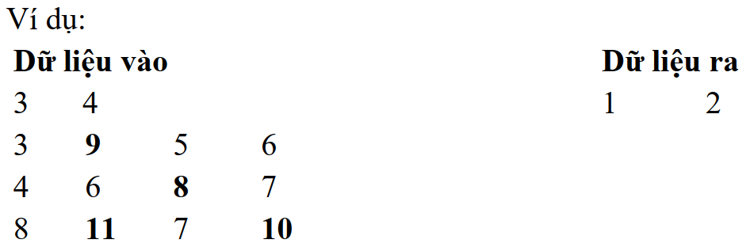

# KỸ THUẬT TỔ CHỨC VÀ XỬ LÝ DỮ LIỆU TRÊN MẢNG 1 CHIỀU, 2 CHIỀU

## Trình độ nhập môn

### 1.1.
Tìm một số trong một mảng bằng lính canh.

### 1.2.
Tìm một số trong một mảng đã có thứ tự (tìm nhị phân).

### 1.3. 
Viết các thủ tục thêm, xóa, sửa, tìm kiếm một phần tử trong một mảng.

### 1.4. 
Viết hàm chuyển một mảng hai chiều thành một mảng một chiều.

### 1.5. 
Viết hàm chuyển một mảng một chiều có MxN phần tử sang một mảng 2 chiều kích thước MxN.

### 1.6.
Thực hiện ghép 2 mảng một chiều A, B để tạo mảng C theo nguyên tắc từng phần tử của mảng A xen kẻ từng phần tử của mảng B.

### 1.7. 
Thực hiện xóa bỏ khoảng trắng thừa và viết hoa đầu từ một chuỗi ký tự cho trước.

### 1.8. 
Cho ma trận A kích thước MxN (0<M,N<100) chứa các số thực nhỏ hơn 100000. Một điểm Xi,j được gọi là điểm lồi nếu như nó lớn hơn cả 4 điểm trên, dưới, trái, phải của nó.

_Yêu cầu_: Tìm Xmin là điểm lồi có giá trị nhỏ nhất của mảng.

- _Dữ liệu vào_: Được nhập từ bàn phím có cấu trúc như sau:
  - Dòng đầu tiên là hai số nguyên dương M, N biểu diễn kích thước của ma trận A (M dòng, N cột).
  - M dòng tiếp theo, mỗi dòng là N số thực (mỗi số cách nhau ít nhất một khoảng trắng) lần lượt là N phần tử của từng dòng tương ứng của ma trận.
- _Dữ liệu ra_: Xuất ra màn hình một dòng duy nhất gồm 2 số nguyên I, J lần lượt là chỉ số dòng và cột của Xmin đầu tiên từ trên xuống và từ trái qua phải. Nếu không có điểm lồi nào thì xuất ra là -1.

