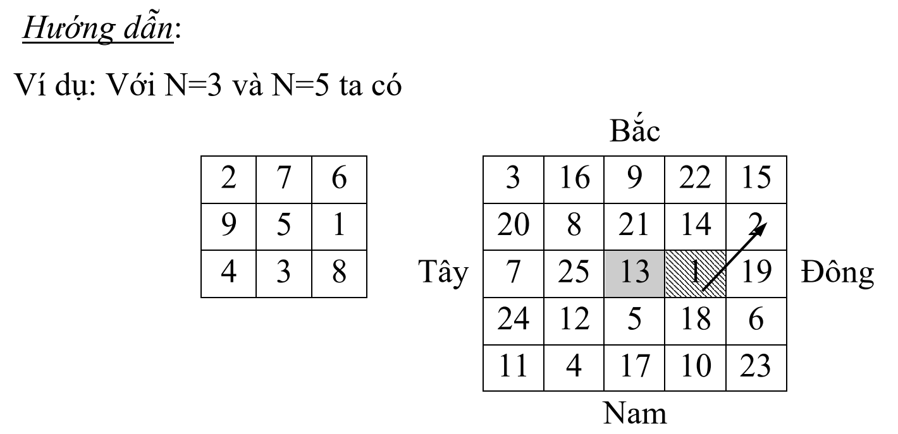

# KỸ THUẬT TỔ CHỨC VÀ XỬ LÝ DỮ LIỆU TRÊN MẢNG 1 CHIỀU, 2 CHIỀU

## Trình độ nhập môn

### 1.1.
Tìm một số trong một mảng bằng lính canh.

### 1.2. [BinarySEARCH.cpp](https://github.com/ITUTE/HCMUTE/blob/master/K%E1%BB%B9%20thu%E1%BA%ADt%20l%E1%BA%ADp%20tr%C3%ACnh%20-%20Programming%20Techniques/C1/BinarySEARCH.cpp)
Tìm một số trong một mảng đã có thứ tự (tìm nhị phân).

### 1.3. [Add, Delete, Replace, Search (Array).cpp](https://github.com/ITUTE/HCMUTE/blob/master/K%E1%BB%B9%20thu%E1%BA%ADt%20l%E1%BA%ADp%20tr%C3%ACnh%20-%20Programming%20Techniques/C1/Add%2C%20Delete%2C%20Replace%2C%20Search%20(Array).cpp)
Viết các thủ tục thêm, xóa, sửa, tìm kiếm một phần tử trong một mảng.

### 1.4. [2Dim_to_1Dim.cpp](https://github.com/ITUTE/HCMUTE/blob/master/K%E1%BB%B9%20thu%E1%BA%ADt%20l%E1%BA%ADp%20tr%C3%ACnh%20-%20Programming%20Techniques/C1/4.2ndDim--to--1stDim.cpp)
Viết hàm chuyển một mảng hai chiều thành một mảng một chiều.

### 1.5. [1Dim_2_2Dim.cpp](https://github.com/ITUTE/HCMUTE/blob/master/K%E1%BB%B9%20thu%E1%BA%ADt%20l%E1%BA%ADp%20tr%C3%ACnh%20-%20Programming%20Techniques/C1/5.1stDim--to--2ndDim.cpp)
Viết hàm chuyển một mảng một chiều có MxN phần tử sang một mảng 2 chiều kích thước MxN.

### 1.6.
Thực hiện ghép 2 mảng một chiều A, B để tạo mảng C theo nguyên tắc từng phần tử của mảng A xen kẻ từng phần tử của mảng B.

### 1.7. 
Thực hiện xóa bỏ khoảng trắng thừa và viết hoa đầu từ một chuỗi ký tự cho trước.

### 1.8. 
Cho ma trận A kích thước MxN (0<M,N<100) chứa các số thực nhỏ hơn 100000. Một điểm Xi,j được gọi là điểm lồi nếu như nó lớn hơn cả 4 điểm trên, dưới, trái, phải của nó.

_Yêu cầu_: Tìm Xmin là điểm lồi có giá trị nhỏ nhất của mảng.

- _Dữ liệu vào_: Được nhập từ bàn phím có cấu trúc như sau:
  - Dòng đầu tiên là hai số nguyên dương M, N biểu diễn kích thước của ma trận A (M dòng, N cột).
  - M dòng tiếp theo, mỗi dòng là N số thực (mỗi số cách nhau ít nhất một khoảng trắng) lần lượt là N phần tử của từng dòng tương ứng của ma trận.
- _Dữ liệu ra_: Xuất ra màn hình một dòng duy nhất gồm 2 số nguyên I, J lần lượt là chỉ số dòng và cột của Xmin đầu tiên từ trên xuống và từ trái qua phải. Nếu không có điểm lồi nào thì xuất ra là -1.

### 1.9.
Nhập vào một số dạng thập phân, chuyển sang dạng nhị phân, bát phân, thập lục phân.

### 1.10.
Nhập vào d, m, y, kiểm tra (d,m,y) có lập thành một ngày tháng năm hay không, nếu có xuất ra ngày tiếp theo.

## Kỹ thuật lập trình

### 1.11.
Tính tổng, hiệu 2 số nguyên lớn:

_Hướng dẫn_:
- Sử dụng kiểu dữ liệu chuỗi (mảng ký tự) cho từng số nguyên.
- Làm bài tính tổng trước, làm được mới tính hiệu, xử lý từng trường hợp 2 số có độ dài bằng nhau, độ dài khác nhau...

### 1.12.
Cho các số 1, 2, 3, 4, 5 và tổng S ban đầu bằng 0. Có 2 người chơi lần lượt chọn một trong các số đã cho theo nguyên tắc không được số mà người kia vừa chọn
trước đó, mỗi lần ai chọn đều cộng dồn vào tổng S.

_Ví dụ_: 

- Ban đầu người A chọn 2 vậy S=0+2=2. 
- Tiếp theo người B chỉ được chọn 1, 3, 4, 5 (không được chọn 2), ví dụ chọn 4, vậy S=2+4=6.
- Tiếp theo A chỉ được chọn 1, 2, 3, 5 (được chọn lại 2 nhưng không được chọn 4), ví dụ chọn 5. Vậy S=6+5=11.
- Tiếp theo B chỉ được chọn 1, 2, 3, 4 (không được chọn 5 vì A mới vừa chọn 5), ví dụ chọn 2. Vậy S=11+2=13...

Ai làm cho tổng S lớn hơn 35 là thua. Lập trình cho người chơi với máy sao cho khả năng thắng của máy là cao nhất.

_Hướng dẫn_: Trò chơi được giải quyết bằng phương pháp Lập bảng phương án.

### 1.13. 
Lập ma trận giá trị bãi mìn cho trò chơi Minesweeper.

### 1.14. (Ma trận kỳ ảo – Ma phương) [N_mp.cpp](https://github.com/ITUTE/HCMUTE/blob/master/K%E1%BB%B9%20thu%E1%BA%ADt%20l%E1%BA%ADp%20tr%C3%ACnh%20-%20Programming%20Techniques/C1/N_mp.cpp) [MaPhuong.cpp](https://github.com/ITUTE/HCMUTE/blob/master/K%E1%BB%B9%20thu%E1%BA%ADt%20l%E1%BA%ADp%20tr%C3%ACnh%20-%20Programming%20Techniques/C1/MaPhuong.cpp)
Viết chương trình nhập vào số tự nhiên N (N lẻ), sau đó điền các số từ 1 đến `N^2` vào trong một bảng vuông sao cho tổng các hàng ngang, hàng dọc và 2 đường chéo đều bằng nhau.

_Hướng dẫn_:

### 1.15. (Bài toán dồn sỏi). 
Cho k và n là 2 số nguyên dương, có `2^k` viên sỏi, được phân bố trong n đống. Người ta cần san sẻ (theo quy tắc dưới đây) lượng sỏi từ các đống để dồn sỏi trở về một đống. Quy tắc san sỏi như sau: mỗi lần san áp dụng cho hai đống sỏi, giả sử rằng một đống có a viên sỏi và còn đống kia có b viên sỏi (không giảm tổng quát, giả thiết a, b) thì cho phép san (thay đổi số lượng từ hai đống) như sau: đống a viên (đống có số sỏi không thua đống còn lại) sẽ là a - b viên, còn đống b trở thành `2*b` viên.

Hãy tìm cách san sỏi để cuối cùng còn 1 đống sỏi với `2^k` viên.

### 1.16. (Bài toán bốc sỏi từ hai đống sỏi). 
Cho 2 đống sỏi, một đống có a viên sỏi, còn đóng kia có b viên sỏi (a, b > 0). Hai đấu thủ lần lượt chơi trò bốc sỏi, mỗi lượt đi mỗi người được quyền bốc theo quy tắc:

- Ít nhất phải bốc được 1 viên.
- Hoặc bốc một lượng sỏi bất kỳ từ một đống, hoặc bốc cùng một lượng sỏi như nhau ở hai đống (nếu đã bốc sỏi ở hai đống).

Đấu thủ đến lượt đi mà không còn sỏi để bốc thì coi như thua cuộc.

Tìm chiến lược đi để người trước thắng.

### 1.17. 
Cho n là số tự nhiên. Cho trước một dãy gồm n ô liên tiếp nhau, mỗi ô hoặc được đánh dấu hoặc không được đánh dấu và chỉ ở một trong hai trạng thái nói trên mà thôi. Một trò chơi hai đấu thủ được mô tả như sau:

- Đầu tiên, toàn bộ n ô chưa bị đánh dấu,
- Hai đấu thủ luân phiên nhau đánh dấu vào các ô trong dãy theo quy tắc:
  - Hoặc chỉ đánh dấu vào một ô, hoặc đánh dấu vào hai ô liên tiếp nhau chưa bị đánh dấu.
  - Người đến lượt đi mà không còn ô chưa đánh dấu là bị thua.

_Hướng dẫn_:
- Trạng thái kết thúc: mọi ô đã bị đánh dấu,
- Tập trạng thái thua: Các miền (miền được hiểu theo nghĩa (1) gồm dãy liên tục các ô chưa đánh dấu, (2) ô bất kỳ, nếu có, phải bị đánh dấu trước) có thể ghép thành các cặp giống hệt nhau:
  - Số miền có 1 ô chưa đánh dấu là chẵn; số miền có 2 ô chưa đánh dấu là chẵn.
  - Chiến lược đi để người đầu tiên thắng:
    - Tại bước đi đầu tiên: nếu n lẻ đánh dấu vào ô có thứ tự `(n div 2)+1` nếu n chẵn đánh dấu hai ô ``(n div 2)` và `(n div 2)+1`.
    - (Sau đó đối thủ đi trước một bước),
    - Mỗi bước tiếp theo sẽ chọn một “bước đi đối xứng” với bước mà đối thủ vừa đi "Đối xứng" ở đây qua trục đối xứng của dãy.

_Ví dụ_, với n = 9 nếu đối thủ xoá đi ô 3 thì ta xóa ô 7, nếu đối thủ xóa đi 2 ô 1 và 2 thì ta xóa 2 ô 8 và 9 v.v. Với n=10, nếu đối thủ xóa ô 3 thì ta xoá ô 8, nếu đối thủ xóa hai ô 1 và 2 thì ta xoá 2 ô 9 và 10 v.v..

Sau mỗi bước đi của ta, trình trạng của dãy có tính đối xứng và vì vậy, hoặc đối thủ gặp trạng thái kết thúc, hoặc ta luôn còn nước đi.

_Chú ý_:
Có thể đặt ra bài toán khó hơn: Từ một trạng thái bất kỳ (một số ô đã bị đánh dấu, còn các ô còn lại thì chưa), hãy tìm chiến lược đi để khả năng người đi trước thắng là cao nhất có thể được. Tương tự lý giải của trường hợp trên, chiến lược đi là đúng định hướng tới việc tạo ra các tình huống đối thủ vào trạng thái thua có thể được; nếu không đưa về “gần trạng thái thua hơn” và không để đối thủ buộc ta vào trạng thái thua. Một số ý tưởng liên quan đến vấn đề này:

- Sử dụng khái niệm ”miền” trước đây. Hai miền khác nhau được gọi là đi cặp với nhau nếu chúng cùng số lượng ô.
- Sau khi đã ghép được các cặp, còn một số miền chưa được ghép cặp: hãy khử số miền theo kiểu này song chú ý chớ nên tạo điều kiện cho đối thủ buộc ta rơi vào trạng thái thua.

### 1.18. (Mở rộng của bài 7.7) [18.cpp](https://github.com/ITUTE/HCMUTE/blob/master/K%E1%BB%B9%20thu%E1%BA%ADt%20l%E1%BA%ADp%20tr%C3%ACnh%20-%20Programming%20Techniques/C1/18.cpp)
Cho m, n là hai số tự nhiên. Cho trước một bảng hai chiều gồm m dòng, mỗi dòng có n cột các ô, mỗi ô được đánh dấu hoặc không được đánh dấu và chỉ ở một ttrong hai trạng thái nói trên mà thôi. Một trò chơi hai đấu thủ được mô tả như sau:

- Đầu tiên toàn bộ m x n ô của bảng chưa bị đánh dấu.
- Hai đấu thủ luân phiên nhau đánh dấu các ô trong dãy theo quy tắc sau:
  - Chỉ đánh dấu vào các ô chưa bị đánh dấu.
  - Đánh dấu từ 1 ô đến 4 ô chưa bị đánh dấu có kề cận đỉnh (hay cạnh) và nằm trọn trong một hình vuông có cạnh dài không quá 2.
- Người đến lượt đi mà không còn ô chưa bị đánh dấu để đi tiếp là bị thua.

Tìm chiến lược đi để người đi trước luôn thắng.

_Hướng dẫn_:
Hoàn toàn có thể sử dụng thuật toán đi đối xứng của bài trên để giải bài này. Có thể mở rộng bài toán như đã làm ở bài toán 3 song ở việc quản lý các miền khó khăn hơn rất nhiều.

### 1.19.
Lập ma trận kỳ ảo theo cách khác bài 6.9 theo như hướng dẫn bên dưới.

- Xuất phát từ ô bên phải của ô nằm giữa. Đi theo hướng đông bắc để điền các số 1, 2, ...
- Khi điền số, cần chú ý một số nguyên tắc sau:
  - Nếu vượt ra phía ngoài bên phải của bảng thì quay trở lại cột đầu tiên.
  - Nếu vượt ra phía ngoài bên trên của bảng thì quay trở lại dòng cuối cùng.
  - Nếu số đã điền k chia hết cho N thì số tiếp theo sẽ được viết trên cùng một hàng với k nhưng cách 1 ô về phía bên phải.
  
### 1.20. 
Viết chương trình in ra các số nguyên từ 1 đến N2 theo hình xoắn ốc với N được nhập vào từ bàn phím. Ví dụ, với N=4 ta có:

1 | 2 | 3 | 4
--- | --- | --- | ---
12 | 13 | 14 | 5
11 | 16 | 15 | 6
10 | 9 | 8 | 7
