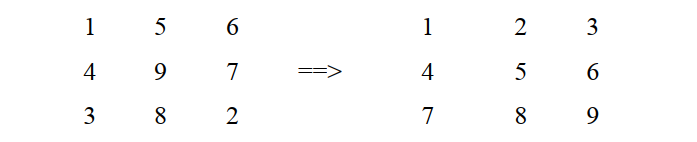

# NHÓM BÀI TẬP SỐ 5

1. Viết chương trình nhập vào một số ở hệ 16, đổi số này sang hệ 10.
2. Cho số nguyên n nhập từ bàn phím. Viết chương trình đổi số này sang các hệ nhị phân, bát phân và thập lục phân. In các kết quả ra màn hình.
3. Viết chương trình nhập vào một mảng các ký tự (chuỗi), xuất ra chuỗi đảo ngược.
4. Viết chương trình đếm số từ trong một chuỗi được nhập từ bàn phím.
5. Viết chương trình xóa bỏ khoảng trắng thừa trong một chuỗi.
6. Viết chương trình đảo ngược các từ trong chuỗi. Ví dụ chuỗi ban đầu là “hoc sinh” thì chuỗi kết quả là “sinh hoc”.
7. Viết chương trình tính tổng các ký tự số có trong chuỗi
8. Viết các hàm trích ra n ký tự đầu tiên/cuối cùng/bắt đầu tại vị trí pos.
9. Viết chương trình kiểm tra một chuỗi có phải là chuỗi con của chuỗi kia hay không?
10. Viết chương trình đổi chữ cái đầu tiên của mỗi từ trong một chuỗi thành chữ hoa.
11. Chuyển các bài tập về mảng số (nguyên, thực) sang cấp phát động.
12. Viết chương trình tính tổng các phần tử trong một mảng 2 chiều có kích thước MxN.

*Cho ma trận vuông A[20][20], có kích thước N. Viết chương trình cho các bài 13 đến 15:*

13. Viết chương trình tính tổng hai ma trận
14. Tính tổng trên các dòng, các cột, trên đường chéo chính, đường chéo phụ.
15. Sắp xếp ma trận sao cho các phần tử trên đường chéo chính tăng dần.

16. Tìm và in ra tất cả các vị trí xuất hiện của số lớn nhất trong ma trận.
17. Tìm vị trí (toạ độ dòng, cột) của số nguyên tố đầu tiên trong mảng 2 chiều m dòng, n cột.
18. Đếm số lượng số chẵn trên biên của ma trận các số thực kích thước mxn.
19. Đếm số lượng giá trị “hoàng hậu” trên ma trận. Một phần tử gọi là hoàng hậu khi nó lớn nhất trên dòng, cột và 2 đường chéo.
20. Đếm số lượng điểm “yên ngựa” trên ma trận. Một phần tử gọi là "yên ngựa" khi nó lớn nhất trên dòng và nhỏ nhất trên cột.
21. Kiểm tra dòng thứ k của ma trận có giảm dần không?
22. Cho ma trận vuông A[20][20], có kích thước N. Viết chương trình sắp xếp lại ma trận tăng dần theo dòng và cột, tức là: 
 
`A[0][0] < A[0][1] < … < A[0][N-1] < A[1][0] < … < A[N-1][N-1]`.

VD: Với N=3:

23. Viết chương trình nhập vào một số nguyên (unsigned long). Xuất ra màn hình cách đọc của số đó. 

Ví dụ: số 107 đọc là `Một trăm lẻ bảy`, số 1065 đọc là `Một ngàn không trăm sáu mươi lăm`.
